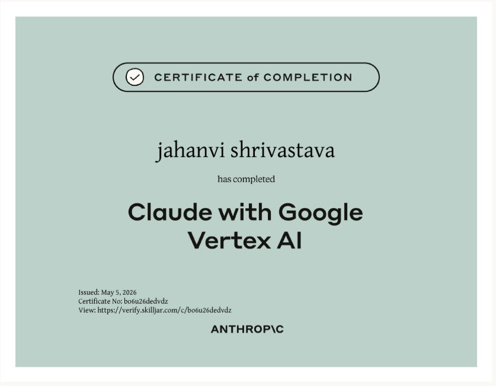

# 🏅 Anthropic Certifications

This folder contains certifications I have completed from Anthropic and Anthropic Education in the areas of Generative AI, Prompt Engineering, and Large Language Models (LLMs).

---

## 📜 AI Fluency: Framework & Foundations
**Issued by:** Anthropic Education

This certification provides a foundational understanding of artificial intelligence concepts, frameworks, and responsible AI practices.

---

## 📜 Claude with Google Vertex AI
**Issued by:** Anthropic

This certification focuses on using Claude models with Google Vertex AI and covers prompt engineering, Generative AI concepts, AI model evaluation, and practical applications of Large Language Models (LLMs).

---

## 🛠️ Skills Demonstrated
- Generative AI
- Prompt Engineering
- Large Language Models (LLMs)
- Google Vertex AI
- AI Model Evaluation
- AI Use Case Development
- Responsible AI
