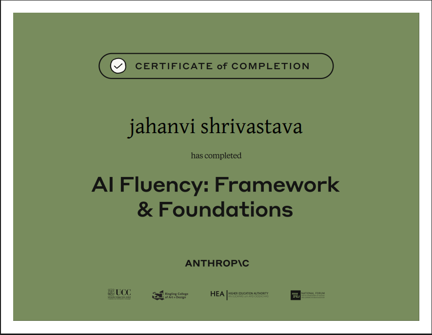

# Anthropic Certifications

This folder contains certifications earned from Anthropic, showcasing foundational knowledge in Artificial Intelligence, responsible AI practices, and practical applications.

## Certificates

### AI Fluency: Framework & Foundations
Issued by Anthropic in collaboration with:
- University College Cork (UCC)
- Ringling College of Art and Design
- Higher Education Authority (HEA)
- National Forum for the Enhancement of Teaching and Learning

### Skills Covered
- Artificial Intelligence Fundamentals  
- Responsible and Ethical AI  
- Prompt Engineering  
- Generative AI Applications  
- Claude for Practical Problem Solving  

### Certificate

