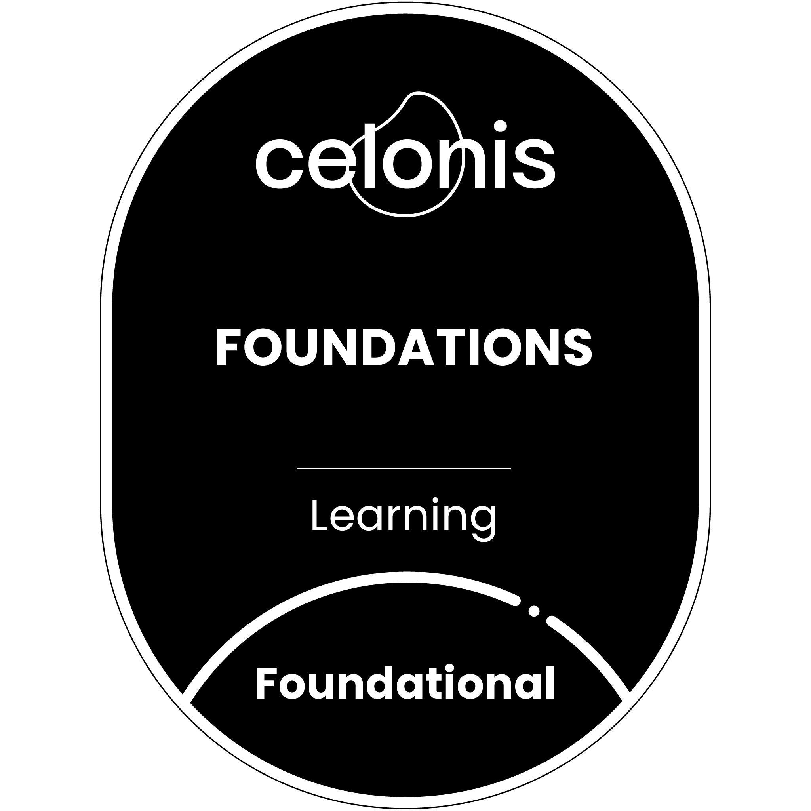

# 🟢 Celonis Certifications

This folder contains my certifications and badges related to Celonis and Process Mining.

---

## Celonis Foundations

📄 [View Certificate](celonis-foundations-certificate.png)

**Description:**  
Gained foundational knowledge of Process Intelligence using Celonis, including process mining concepts, data analysis, and workflow optimization.

---

## Process Mining: From Theory to Execution

📄 [View Certificate](process-mining-certificate.png)

**Description:**  
Developed practical understanding of process mining techniques, event log analysis, and identifying inefficiencies to optimize business processes using Celonis tools.

---
