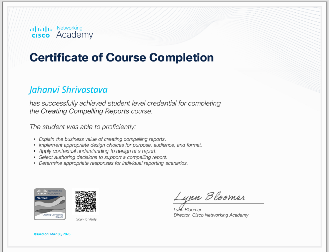

# Cisco Networking Academy Certificate

**Certificate Holder:** Jahanvi Shrivastava  
**Course Name:** Creating Compelling Reports  
**Issued By:** Cisco Networking Academy  
**Issued On:** 6th March 2026  

---

## Skills Covered

- Explain the business value of creating compelling reports
- Apply appropriate design choices for purpose, audience, and format
- Apply contextual understanding to design a report
- Select authoring decisions to support a compelling report
- Determine appropriate responses for individual reporting scenarios

---

## View Certificate

[Download Certificate](cisco/Creating_Compelling_Reports_Certificate.PNG)

---

## Badge

